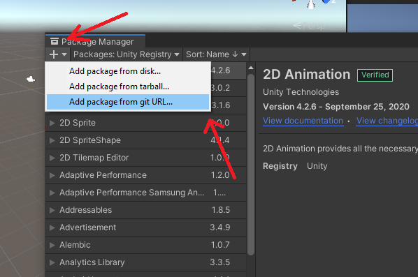
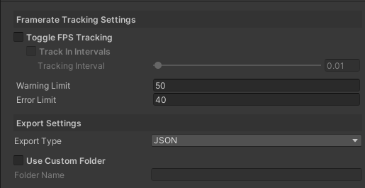

  

> BE AWARE: OcuLog was created as a logging plugin for VR projects at Aalborg University back in 2021. The plugin has since then gone out of support. The reason for the project now becoming open-source is to allow any interested parties to continue the development on the project on their own time.

# OcuLog - Unity Plugin
OcuLog is a Unity plugin package made for Unity 2020.1 and up. It provides you with tracking and logging of game objects within your scene, and/or direct tracking of your preffered VR headset and controllers through the Unity XR Toolkit.

> __Be aware that OcuLog does currently NOT support the action-based input model for the Unity XR Toolkit. If you're using this input model for your project you can only use the default logger components and the Unity XR guardian tracking.__

## Installation

>NOTE: Since the repository is currently private, the only way of installing is by downloading this repository and choosing the "*Add package from disk...*" option in the package manager inside your project.

The installation of OcuLog is done through the Unity Package Manager. All you have to do is navigate to the package manager window in your current project, and click the plus sign in the upper right corner. From there select the *"add package from git url..."* option and paste in the url for this repository.

Once the package manager is done importing the you will be greeted by the OcuLog welcome screen. From here you have the option of doing a quick setup for your current scene. 

We recommend that you use the quick setup if it is your first time using this plugin, as it will generate the necessary structure needed for the logging of your application to take place.

## How It Works
OcuLog uses ScriptableObjects and a main manager to perform its tracking and logging of components. Currently the only required component actually needed within your scene for tracking to take place is the LogMaster. The LogMaster can be attached to any object through the *Add Component* menu, however we recommend using the LogMaster component on an empty game object.

In order for the LogMaster to actually log and export your data you'll have to create a ScriptableObject in your project of the type LogMasterSettings.

### Simple Setup
Through the OcuLog greeting screen you can easily get off to a good start using the *Quick Setup* menu. It will generate the LogMaster within your scene with a LogMasterSettings object in your project folder and assign it automatically.

Once you've done this it is a very good idea to navigate into the *OcuLog* folder that got created in your project and setup the settings object to fit your needs. This will provide you with the foundation for all the future logging you want to do.

### Log Master
The LogMaster component is the brain behind the operation. It handles the initialization of the DataLogger hidden behind the curtains and also comes with the ability to track FPS, Unity XR API, and selecting the format in which way you want your data exported. 

#### **ScriptableObject Settings - LogMasterSettings**

The settings object for the LogMaster allows FPS tracking with error/warning messages, allowing you to decide when you think that the framerate is hitting a point that you want to mark as either a warning or error value.

The exporting options are currently limited to be either JSON or CSV formatting, with the possibility for a custom folder to contain the data in. 

All data will always be exported to the persistent data path of the system that the application is running on. This is done so that logging is also available on the Oculus Quest systems. The specific path will be specified in the inspector, however it can vary on the Quest systems, so please do a pilot check with your application to know the specific path.

#### **XR Specific Logging**
>Only works for Device-Based input

The LogMaster component also comes with a XR API targeting setup, meaning that you can enable tracking and logging of data that is specific to the Unity XR Toolkit. 

Currently the LogMaster supports the following properties to be tracked:

-------------------------------------
| Tracking Type | Description | Device(s) |
| ------------- | :---------- | :-------: |
| Guardian      | Interaction with the guardian wall | HMD, Controllers |
| Position      | Position of the device | HMD, Controllers |
| Rotation      | Rotation of the device | HMD, Controllers |
| Velocity      | Velocity of the device | HMD, Controllers |
| Acceleration  | Acceleration of the device | Controllers  |
| Trigger Input | Notes when the button is pressed and released | Controllers |
| Grip Input    | Notes when the button is pressed and released | Controllers |
| Face Buttons  | Notes when the A and B buttons are pressed and released | Controllers |
| Joystick      | Notes the vector of the joystick and if the joystick has been pressed | Controllers |
| Tracking Loss | Notes when tracking for controllers have been obtained and when it is lost | Controllers |
--------------------------
A quick note about the guardian tracking; it has only been tested on Oculus devices and therefore we can only assure you that it works on this platform.

### Logger Components
OcuLog also comes out of the box with some Unity native logging capabilities that does not require the application to actually be a VR application. 

With these logger components and their accompanying setting objects you can setup trackers from controllers that are not supported by the XR API to static environmental objects or triggers in your environment. 

All settings objects can be created by right clicking in your project folder and going into the OcuLog section.

#### **Base Component** 
The base LoggerComponent is a MonoBehaviour script that you can attach to any active Unity game object. All it requires is a settings object of the type of either Static, Trigger or Dynamic. 

All of these setting objects require you to input an ID for it to log the component to. The ID itself can be anything you want it to be, just remember that it must be unique for each individual object, or at least for each separation of data that you want.

#### **Static Logger Settings**
If you choose to use the static logger settings for one of your logger components then you will be able to quickly log, at the start of your application's runtime, the position, rotation, or scale of the object that the component is attached to.

This is useful for indicating markers around your scene and gathering edge points that you can later use for visualization of the application world. 

#### **Dynamic Logger Settings**
The dynamic settings are a type of setting that can be used to track an object in your application's scene at any given time. It allows for either tracking each frame of the application's runtime, or at intervals set by you through the property in the object.

This setting is perfect for doing tracking on VR devices that are not yet supported by the XR API, or entities in your game scene that move around during runtime. 

#### **Trigger Logger Settings**
The last option of LoggerComponent settings is the trigger settings object. This object can be used with the LoggerComponent to allow for tracking of trigger interactions between two colliders. Be aware that this type does require some additional setup on the object that you choose to track. 

The additional setup just requires you to attach a collider and scale it to the desired radius or size that you want. Remember to set the collider's trigger option to true. The component also needs to have a counterpart that contains a RigidBody component or that the trigger has a RigidBody itself that is set to kinematic and not using gravity.

This specific setting is useful for tracking interactions between objects. The way that the trigger works is by logging down what object just interacted with it and at what time. 
